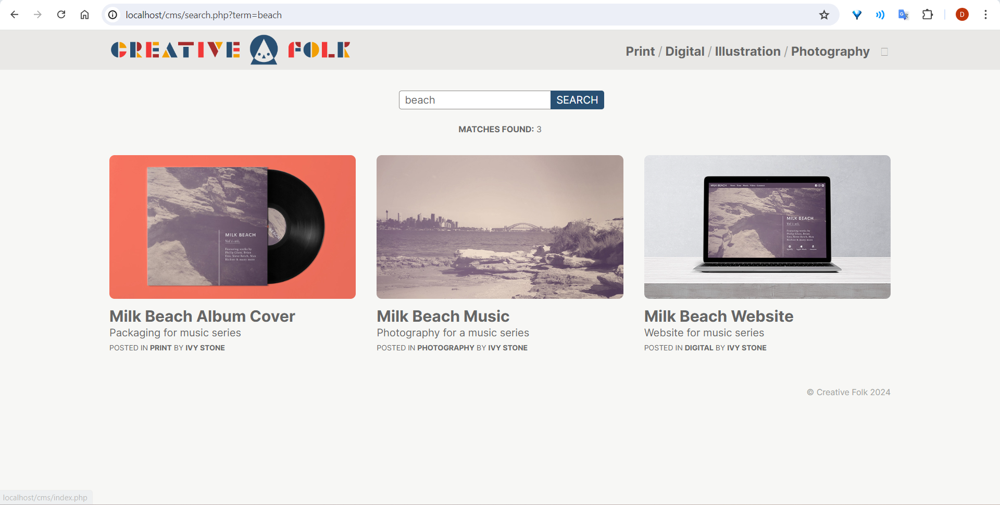
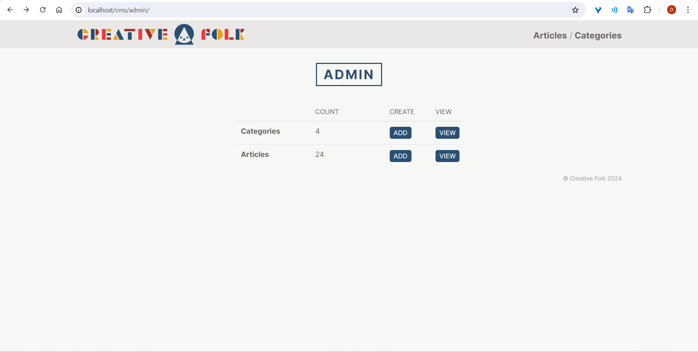
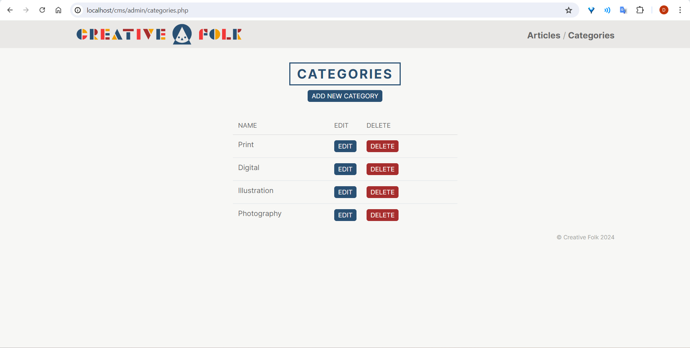
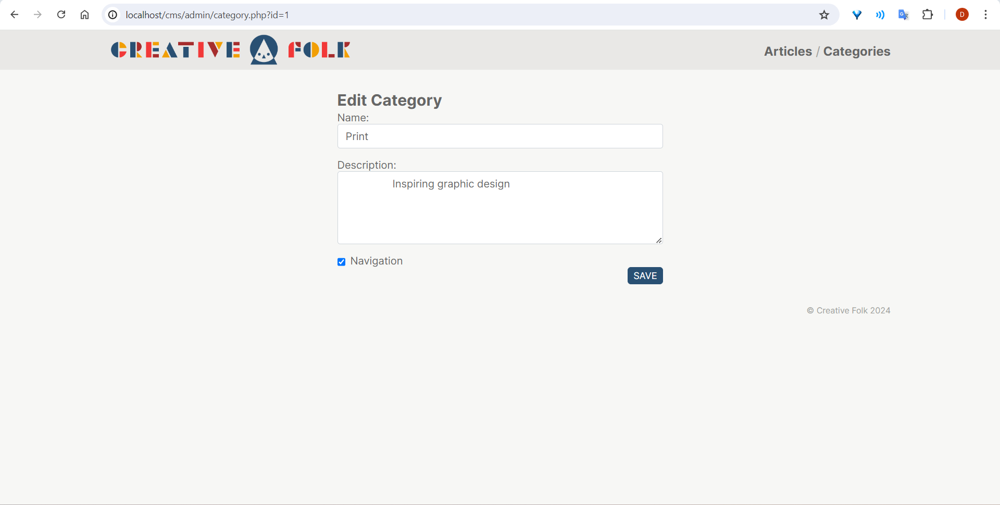

# Content Management System

This is a simple project using Core PHP

## Screenshots

## Getting Started

### Prerequisites

- PHP 8.x
- XAMPP
- Imagick and ImageMagick

## How To Run

- Launch XAMPP Control Panel and Start `Apache` and `MySQL` modules

- Go to `localhost/phpmyadmin/`, create database `cms`, create database user with crud privileges (update database-connection.php as needed) and import `data/cms.sql`

- Copy root directory to `C:\xampp\htdocs` (default installation directory)

- Go to `localhost/cms/`
